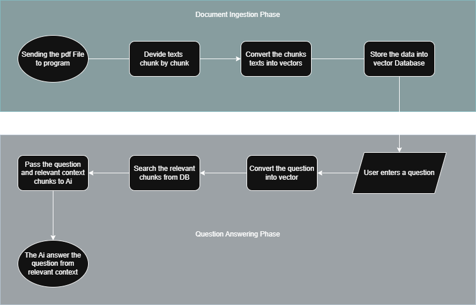

# [🤖 LLM_Local_RAG](https://github.com/YandLim/Local-RAG)
A simple and fast local RAG chatbot built with Python, FAISS, and Ollama.
It reads your own documents like PDFs, finds the most relevant info, and gives clear answers using a local AI model.
No API keys, no internet, everything runs on your machine.

## ✨ The story behind this project
I built this because I wanted a chatbot that could read my own data without needing cloud access or paid APIs.
At first, I just wanted to understand how RAG really works, but then it became something I could actually use and show.
This project helped me learn how retrieval and generation really connect in practice.
It’s simple, fast, and works offline, which was exactly the goal.

## 📋 Features
- Reads and processes PDF files locally
- Converts text into vector embeddings using multilingual models
- Uses FAISS for fast and accurate similarity search
- Answers questions through local AI models on Ollama (Phi-3, Mistral, Gemma)
- Works fully offline
- Code is clean and modular, split into Retrieval and Generation parts

## ⚙️ How it works
- Load a document
- Split the text into smaller chunks
- Convert each chunk into an embedding
- Store everything inside FAISS
- When you ask a question, it finds the most similar chunks
- Sends them to the local AI model and returns the answer
  
## 🧩 System Architecture


Two main sections:
- Retrieval – handles reading, embedding, and searching chunks
- Generation – builds the prompt and generates the final answer

## 💻 Example Usage
```
python main.py
# Choose a PDF file
# Ask: What Is Pokemon?
# Bot: Pokémon are creatures that inhabit the world of the Pokémon universe. The core idea revolves around friendship, adventure, and growth, both for the Pokémon themselves and their trainers.
```

## 🛠️ Tech Stack
1. Python
  - The main programming language that connects every part of the system.
2. FAISS
  - Used for fast vector similarity search.
  - Stores and retrieves embeddings efficiently.
3. SentenceTransformers
  - Converts text and questions into embeddings.
  - Works well with multiple languages including Bahasa Indonesia.
4. NumPy
  - Handles numerical operations and converts embeddings into the right format for FAISS.
5. PyPDF2
  - Reads and extracts text from PDF files before they are processed.
6. Requests
  - Sends the formatted question and context to Ollama’s local API for generating responses.
7. Ollama
  - Runs the local AI models like Phi-3, Mistral, or Gemma.
  - Generates the final answer directly on your machine.
8. Tkinter
  - Opens a simple file picker so you can select the document to analyze.
9. Dotenv
  - Keeps model names and settings clean and separate inside a .env file.

## 🫡 What I learned
1. A good embedding model changes everything
2. FAISS makes search extremely fast
3. Keeping Retrieval and Generation separate makes the code easier to manage
4. You can build a real RAG chatbot without relying on APIs


